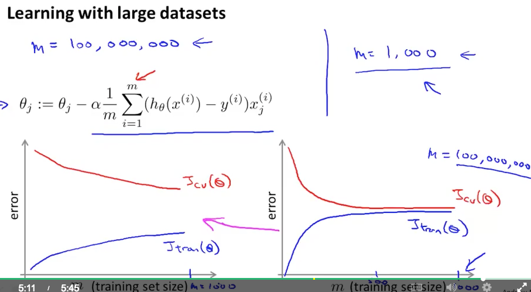
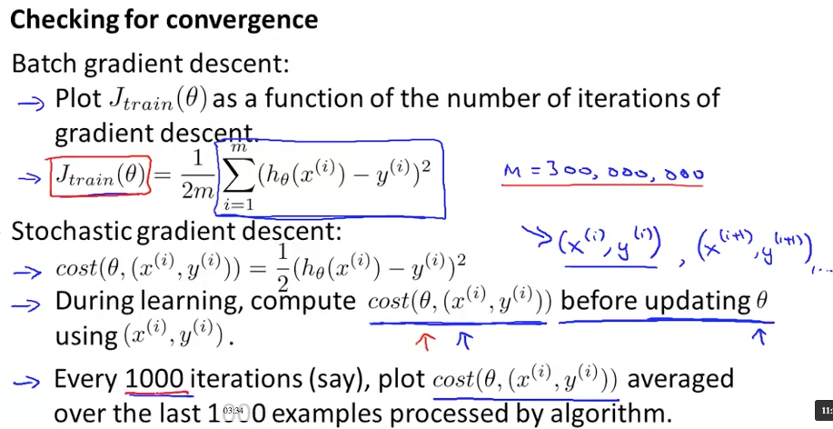
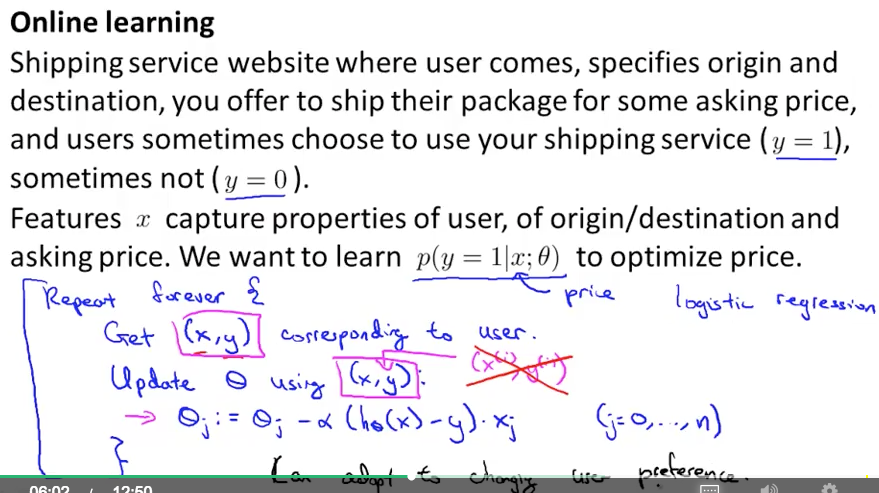

# Large Scale Machine Learning

### Learning With Large Datasets

* 5年前よりもAIが進化したのはデータの量のおかげでもある
* 最高のアルゴリズムが勝つのではなく、最も多いデータを持つ者が勝つ
* データ数1億、これは現実にありうる
* hundred million
* gradient descentの1 stepで1億回足すのはexpensive
* アルゴリズムのsanity checkとして、1000データでまず動かすのがいい
* m: データ数
* mが小さいときはhigh variance
* 特徴を増やすと左のグラフになる

* 手法
	* stochastic gradient descent
	* Map Reduce
	
### Stochastic Gradient Descent

* stochasticの考え方はlogistic regression, NNなどにも適用できる
* 1 stepで1つの訓練データだけを見てθを更新する
* global minimumの近くの値が得られ、それで十分

### Mini-Batch Gradient Descent

* stochasticより速い
* 1 stepでb個の訓練データだけを見てθを更新する
* θの更新回数が減るし、b個ならメモリに乗るしvectorizeされたsumなのでparallelizeできる
* 教授は普段b=10にしている。2~100くらいがいい

### Stochastic Gradient Descent Convergence

* 最適化が収束したことをどうやってたしかめる？（GDならJをループごとにPlotした）
* learning rateはどう決める？
* 最適値にfluctuateしながら近づくので、Jの平均で評価する(m=1000)
* Jが揺れながらもplateauになったらconvergeしたといえる
* smaller learning rateを使うと収束は遅くなるがJは少し良くなる（最適値からのぶれのため。大きな差ではない）
* Jが減ってないときは、学習していない
* Jが上がっていく(diverging)ときはαを下げる
* stochasticだとglobal minimumの近くで揺れて収束はしない。αを徐々に下げるのが有効。しかしパラメータが増えるのでやらない人も多い

### Online Learning

* Suggest packing plan
	* 「ここからここまでの配送でしたら、この配送方法、$xxでいかがでしょう」と提示するサービス
	* stochasticのように1つのデータでθを更新するのを、新しく来たデータでも行う
	* 最近のユーザの好み(user taste)に適応することができる
* Product search
	* CTR: click through rate: クリックしてくれる確率
	* それが高い順にSearch結果を表示する (learning to rank)
	* 10件候補を提示する場合、その後得られる訓練データは10ふえる
	* (候補の2番目を選んだとして、3番目以降もy=0として学習していいのかな？)
* 現実はfixed training setではなくて、どんどん増えるデータをonline learningする必要がある
* (Youtubeのオススメ動画も、最近見たものの影響が強い。online learningしているのだろう)
* 訓練データを使ったらもう忘れちゃっていいのも良い点

### Map Reduce and Data Parallelism

* Map Reduce
	* 複数のコンピュータで並列処理する。たとえばθ更新時のsumは分割処理可能
	* 実際はnetwork latencyやoverhead of combiningを考慮する必要
	* 訓練データのsumを見かけたら分割可能
	* マルチコアでも考え方は同じ
	* linear algebra libraryは自動で並列コアで処理してくれる
* Hadoop

