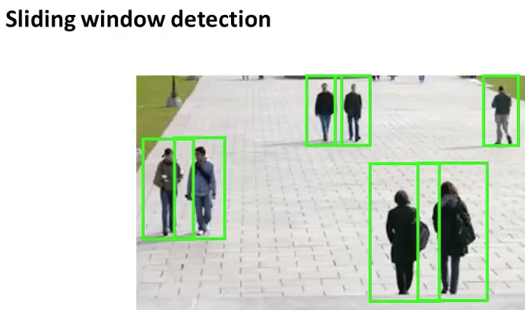
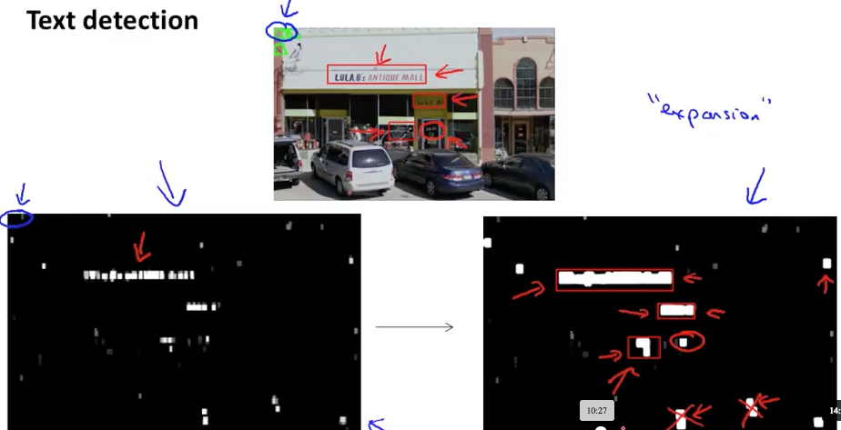
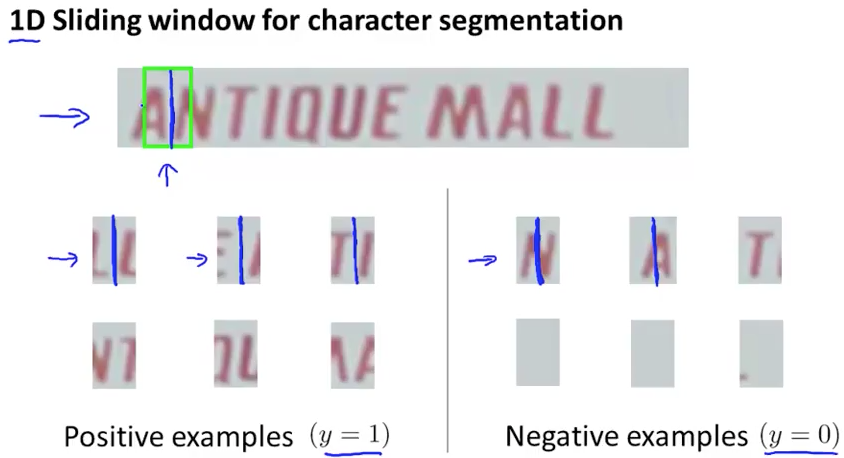
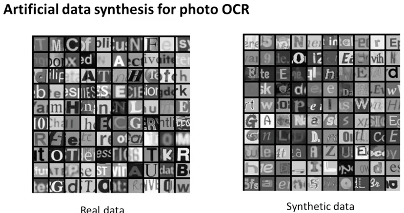
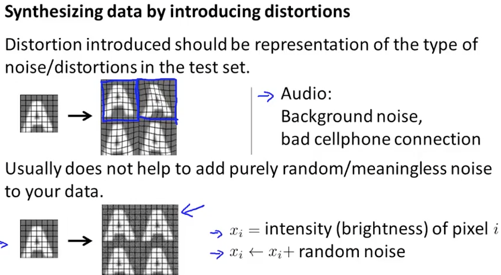
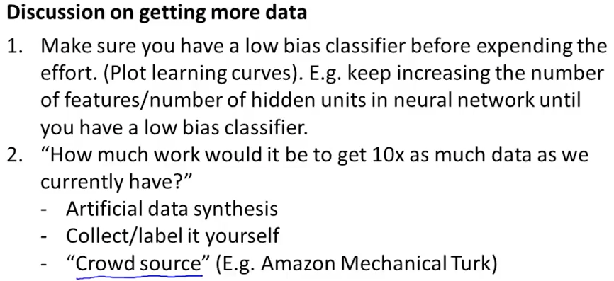

# Application Example: Photo OCR

### Problem Description and Pipeline

* 写真の中の文字を認識できれば、文字で画像を検索できる
* OCR
	* 1 文字の領域を認識する(Text detection)
	* 2 文字ごとに分割する(Character segmentation)
	* 3 文字を読む(Character classification)
	* 4 認識した文字を文脈で訂正する（今回は省略）e.g. C1eaning -> Cleaning
* car navigation systemにも使える
* machine learning pipeline
* やりたいことを実現するためにシステムをmoduleに分割する
* 分けるとエンジニアのアサインも楽になる

### Sliding Windows

* pedestrian detectionはtext detectionよりも楽。aspect ratioが固定されているから
* 画像の部分領域(image patch)をずらしながら、歩行者かを判定する
* step size = 1, 4, 8
* loop, then, larger image patch

* text detection
* 領域を膨らませる
* tall and thinな領域は無視
* character split detection

### Getting Lots of Data and Artificial Data

* low biasなアルゴリズム＋large data setが良い
* artificial data synthesis
* 文字データを増やす
	* 多くのフォントデータがある。それをrandom backgroundに書いて訓練データとする(synthetic data)
	* そしてぼかしたり、斜めにしたりする
	* 1文字で作るのではなくて、左右にもアルファベットがある画像も訓練データとするとよさそうで、その時のアルファベットはランダムよりも実在する英単語の確率で置いた方がよさそう（こだわりすぎかも）
	* 実データをartificial warpingでゆがませて訓練データを増幅する方法もある
	* 歪ませて増幅するのは効果がある
	* 完全なノイズを乗せるのは意味がない（ノイズには情報量・関連性がない？）
* オーディオデータでも増幅できる
	* 後ろにビープ音・ガヤガヤ音・機械音などのノイズを乗せる
* low bias, high varianceであることをlearning curveから確認する
* 「10倍のデータが得られたらどれくらい良くなる？」は良い問い
* 自分で訓練データを作るという手もある。10sec/example, 10000dataとすると、10万秒。=28時間

### Ceiling Analysis: What Part of the Pipeline to Work on Next

* 各エンジニアがｍoduleを作っていて、改善がなかったというのは避けたい。そこでceiling analysis
* TODO