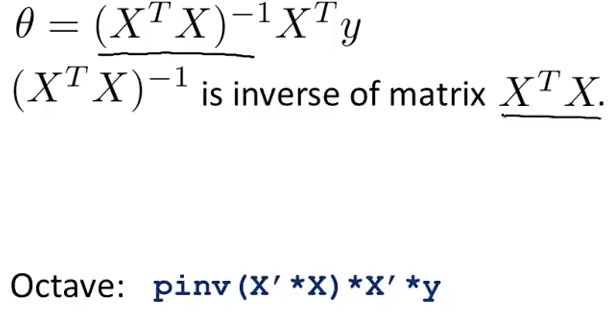

# Week 2

* 多変数の線形回帰
* Notation
* superscript, subscript
* x0 = 1
* すると仮定hがx, θの各ベクトルのかけ算で書ける
* n変数のときベクトルの長さはx0も含めるとn+1次元
* 横ベクトルにするには転置(transpose)

### Cost Function

* データ数mとすると、1/2mで割る
* J(thetas) = 1/2m * sigma_m (h - y)^2
* 二乗にしてるのも都合上だよね
* 更新式 theta_j = theta_j - a * Jをtheta_jで偏微分したもの
* partial derivative
* gradient descent

### Feature Scaling

* practical tricks
* コスト関数が楕円になってしまう without scaling
* するとGDでジグザグにたどることになる
* Max値で割って0-1にする
* -1<= x <= 1にするのもある
* Mean normalization: (データ - mean)/(max-min)
* myu_1 : mean
* (max - min)で割る for standard deviation?
* これで速く収束する

### Learning rate α

* GDが正しく動いているかをDebuggingする。グラフを書けばいい
* 毎回コストJが下がることを確認する
* 収束する converge
* flatten
* small value ε（イプシロン）より差分が小さくなったら収束とする
* Jが増えた場合、バグ or (learning rate)αが大きすぎ
* Jが波打った場合、同じくαが大きすぎ
* αが十分に小さい場合はJは毎回下がる
* α = 0.0001, 0.001, ..., 1, 

### Polynomial Regression

* ノンリニア
* quadratic model
* モデルの表現力
* 3乗とかするのでfeature scalingが重要になる
* square root funcitonを使うことも（ルート）

### Computing Parameters Analytically

* Normal Equation?
* 計算で一発で出す。微分して０とおく
* データの行列がそのまま数学の行列になる

* 特徴の数 n
* 訓練データの数 m
* 特徴ベクトルの長さはx0を含めて n+1
* X (design matrix)
* 解析的に解くときはFeature Scalingは不要

* データ数が1000以下ならNormal Equasionを使う

* non-invertibility?
* 逆行列計算不可能？
* singular / degenerate matrixはnon-invertible
* そんなに起こらない
* Octave pinv, inv 
* pinv (pseudo-inverse) ..non-invertibleでも逆行列（に近いもの？）を求められる
* regularization?

### Octave

* Octaveの中からsubmit()で提出する

### Octave Tutorial

* Python, C++, Javaとかあるけど、OctaveがHigh Levelでプロトタイピングには良い
* うまくいったらもっと速い言語で書けばいい
* Numpy, R

### MacでのOctaveインストール方法

* brew tap homebrew/science
* brew install Caskroom/cask/xquartz
* brew update && brew upgrade
* brew install octave

### 文法

* 1  ~= 0
* %でコメント
* PS('>> ');
* pi
* disp()
* sprintf
* format long
* format short
* A = [1 2; 3 4]
* v = [1 2 3]
* v = 1:0.1:2 刻み
* v = 1:6
* ones(2,3)
* rand(3,3)
* randn(1,3)
* hist(w)
* hist(w, 50) #bin
* eye(4) identity matrix
* help
* help rand

### Moving Data Around (データの操作方法)

* size(A)
* size(A, 1)
* length(B)
* length(A) longer
* pwd
* cd
* ls
* .dat を読み込む
* load featuresX.dat ファイル名がそのまま変数になる
* load priceY.dat
* who (show variables)
* whos (detailed)
* clear featuresX
* v = priceY(1:10)
* save hello.mat v;
* save hello.mat v -ascii;
* clear (all)
* A(3,2)
* A(2,:) 2行目
* A([1 3], :) 1,3行目
* A(:, 2) ＝ [1; 2; 3] 2行目を入れ替え
* A = [A, [1; 2; 3]]; 列の連結
* C = [A B] 行列を横に連結
* C = [A; B] 行列を縦に連結

### Computing on Data

* A*B 行列のかけ算
* A.*B 要素ごとのかけ算
* . = element wise
* A.^2 各要素を二乗
* 1 ./ v
* log(v)
* exp(v)
* abs(v)
* v + ones(length(v), 1)
* ones(3, 1)
* v + 1
* A' transpose
* max(a)
* [val, ind] = max(A)
* A < 3 (0/1の行列が返る)
* find(A<3)
* A = magic(3)
* [r, c] = find(A>=7) row, column
* sum(a)
* prod(a) かけ算
* floor(a)
* ceil(a)
* rand(3) 3x3 matrix
* max(rand(3), rand(3)) 各要素で大きい方
* max(A, [], 1) columnwise
* max(A, [], 2) rowwise
* A(:) 行列のベクトル化
* sum(A, 1) columnwise
* sum(sum(A.*eye(9))) 斜めの和
* flipud(eye(9)) 上下入れ替え flip up down

### Plotting Data

* データをPlotすることで正常動作を確認できる
* どう改善するかのSenseも与えてくれる

* hold onで重ねPlot

* xlabel('time')
* ylabel Plotのラベル
* legend('sin', 'cos')
* title('title')
* print -dpng 'aaa.png' 画像で保存
* close Plotウィンドウ閉じる
* figure(1)
* figure(2) ウィンドウを分ける
* subplot 1ウィンドウに複数Plot
 

* axis([0.5 1 -1 1]) 軸の範囲を指定
* clf clear-figure
* A = magic(5)
* imagesc(A) 行列を色を付けてPlot
* colorbar, colormap gray; Plotの色をグレー
* a = 1, b = 2

### for, while, if...

* v = zeros(10, 1)
* for i=1:10, ..., end;
* indices = 1:10;
* for i=indices ...
* while i<=5, ...; end;
* disp('aaa') print
* exit
* quit
* filename.m

### 関数定義

* function y = functionName(x)
* y = x^2
* .mファイルがあるところからならloadなしで呼べる
* addpath('...') 関数を探すパス追加

### 関数定義２

* funciton [y1, y2] = aaa(x)
* y1 = x^2
* y2 = x^3

### コスト関数も同様に定義

X = [1 1; 1 2; 1 3] design matrix

### Vectorization

* run much faster
* numerical algorithm PhDの人たちによりライブラリは最適化されている
* 数学では基本縦ベクトル
* Octaveでは基本横ベクトル
* forで1要素ずつ計算するのはunvectorized
* octaveのindexは1からはじまる
* prediction h = theta' * x;
* inner product
* Gradient Descentの各θもvectorized implementationできる

### Quiz (octave totorial)

* 4/5 pass
* Q5 miss...
* why?

### Programming tips from Mentors

* Xは全訓練データセット
* xはシングルデータ
* h = hypothesis
* h = theta' * x
* 質問する前にPostを見よ
* 提出するときは submit
* 関数名でForumを検索
* unit test
* 関数のreturn前に keyboard コマンドを入れてDebugging
* test case
* 点数を判定してくれる？ grader

### Quiz (Linear Regression with Multiple Variables)

* Octaveじゃない方のクイズ課題
* 1:meanで引いて(max-min)で割ってみる
* 2:easy
* 3:thetaも特徴の種類＋１の長さ
* 4:データ数100万のときは逆行列時間かかるのでGradient Descent
* 5:easy
* 4/5で1だけ間違った

### Programming Assienment 環境設定

* brew reinstall octave --with-gui
* こうInstallしないとsubmitしても0点だった（Mac）
* さらに、Plotのために
* brew uninstall fontconfig
* brew install fontconfig --universal

### このコードが問題なく実行できるか

* data = load('ex1data1.txt');
* x = data(:, 1); y = data(:, 2);
* m = length(y); 
* plot(x, y, 'rx', 'MarkerSize', 10);
* fontconfigのやつをやったらPlotが表示された

### つづき

* パラメータのrxってレッドのクロスって意味か
* θ0はintercept term
* GDの更新式

* これを参考にgradientDescent.mを埋める
* 行列のかけ算をしたら自然と和がとられるのに、Σにひきづられてsum()を書いていたので二重に和をしていてはまった...
* 「なんでうまくいかないんだろう？」とはまる時間が長かった
* Advance Topic以外を解いてSubmit

### Advanced Topic

* 得点はないが余裕があればやるべきQuiz

### Feature Scaling

* Quiz通らないなーと思ったら通ってた。Scoreが0だから通ってないと思っていたが、満点でも0点だった。Feedback=Nice work!となっていることを確認すればよかった・・・

### 多変数のコスト関数とGD

* 一変数のときにvectorizeされていたので同じコードでOK

### Normal Equasions

* ループを回すのではなく数式で解けるやつ closed-form
* 全問題正解したのでWeek 2完了

[week3 note](https://github.com/peroon/coursela/tree/master/machine_learning/week3)