# Week 3

### logistic regression

* for classification
* i.e. spam / not spam

### Regularization

* overfittingを避けるため

### Classification (Movie)

* logistic regressionはmost popular & widely used
* スパム判定
* オンライントランザクションがFraudulent or not
* Tumor malignant / benign
* y ∈ {0, 1} binary classification
* y ∈ {0, 1, 2, ...} multiclass classification
* 分類にはthresholdが必要 i.e. 0.5
* linear regression + thresholdで分類すると下のような問題が発生する

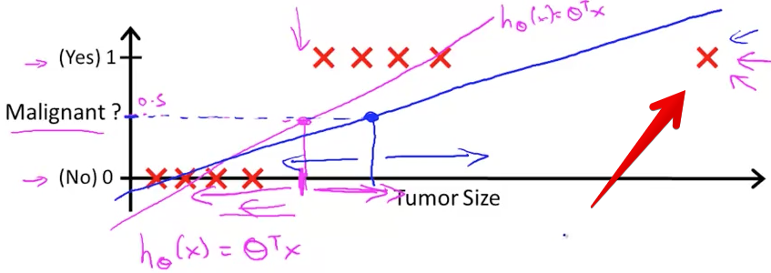

* hが0より小さく、1より大きくなるのも不自然
* そこで、logistic regression. これでは 0 <= h <= 1
* h = g(θx)
* g = 1 / (1+e^-z) ...sigmoid function, logistic function
* シグモイド関数で丸め込む
* hはy=1の確率を表すようになる

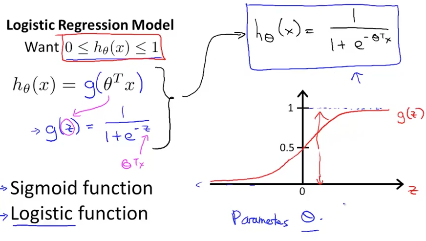

### Decision Boundary

* h >= 0.5
* イコール θx >= 0
* 外れ値を学習しちゃうとθが影響を受ける問題はどう解決するのか？
* decision boundary 特徴空間を切るもの
* polynomialなら下の空間も分離できる

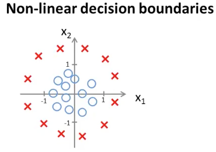

* -1 + x1^2 + x2^2 >= 0
* θ = decision boundary

### Cost Function

* linear regressionのJ定義では、non-convex? of theta
* non-convexだとGDが効かない(global minimumじゃなくてlocal minimumに落ちてしまう)

* logでコスト関数を定義する理由がわからない
* それはconvex optimization problemから来るが、講義の範囲をこえている
* yと違うほうに判定しちゃうθのときはCostを無限大にする

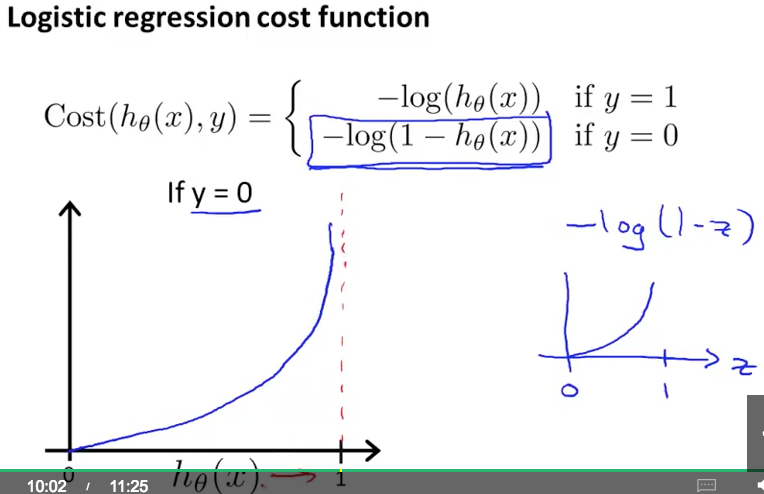

### Simplified Cost Function and Gradient Descent

* maximum likelihood estimation
* 2つの式を1つにした。これはconvex
* convexである証明？

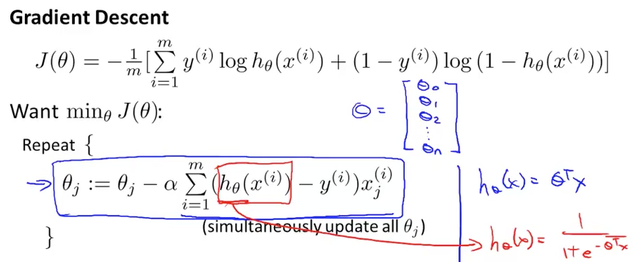

* GDのθ更新式がLinear Regressionと同じ
* 全く同じアルゴリズムか？いや、hの中が違う
* （そもそもJのθ微分でその更新式になることを証明したい）
* Logistic RegressionでもFeature Scalingは有効
* LRはMostly used

###　Advanced Optimization

* J partial derivative
* Jは計算できる必要がない？
* 他のアルゴリズム

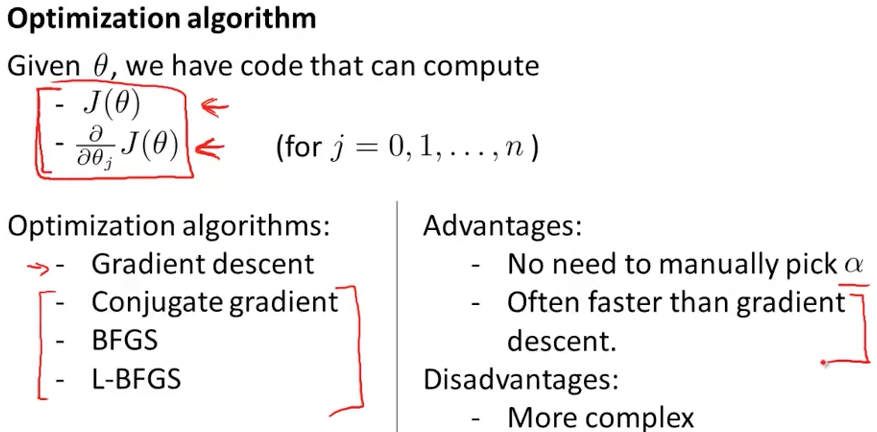

* それらを自分で組むのは避けた方がいい
* ルートや逆行列もライブラリを使うのがいい。あなたがNumerical Computingの専門家でないならば
* fminuncを使えば最適化問題は解ける

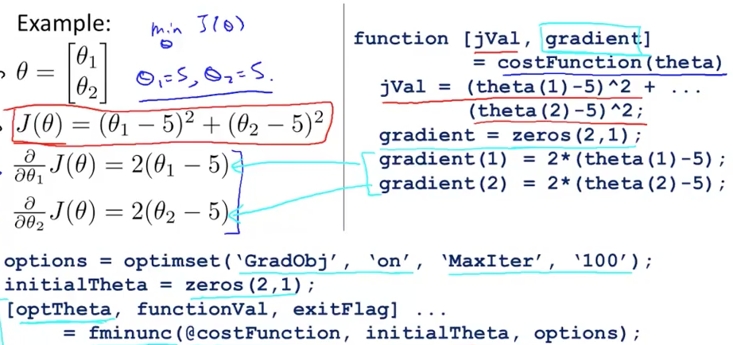

* gradient(n+1)を考えると、微分もvectorizeで書ける必要がある

### Multiclass Classification: One-vs-all

* cf. binary classification
* one-vs-restともよばれる
* 3クラスなら、3つのbinary classificationとして判定する
* 学習コストも判定コストもn倍になるよね
* max hを出すクラスに判定する

### Quiz

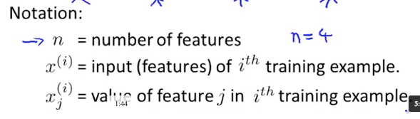

* 5/5 pass

### Solving the Problem of Overfitting

* overfitting
* ameliorate
* underfittingそのとき、high bias?
* overfittingそのとき、high variance?
* preconception 先入観
* quadratic function 二次の
* recap 再生する
* 回帰で言えば、特徴（調整パラメータ）が多すぎるとoverfittingする
* overfittingしてしまうとgeneralizeできたとは言えない

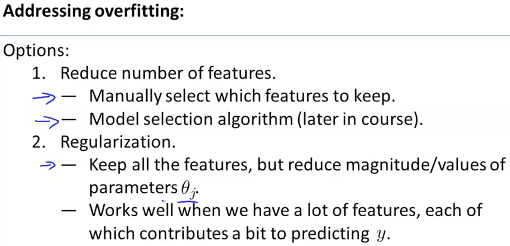

* regularizationの項をコスト関数Jにつけたす。θが小さいとモデルがシンプルになりoverfittingが避けられる？
* λはregularization parameterで、tradeoff(訓練データへのフィットとシンプルさ)を調整する
* λが大きすぎるとθを小さくすることだけに注力してしまい、underfittingする（θ_0のみλの影響を受けないのでθ_0だけ残り、それがhとなる）
* λを自動で決める方法は後述

### Regularized Linear Regression

* コスト関数が変わったからGDでのθ更新式も変わる
* θ_0だけはRegularizationの管理外なので更新式もθ_0専用のものとなる（以下）

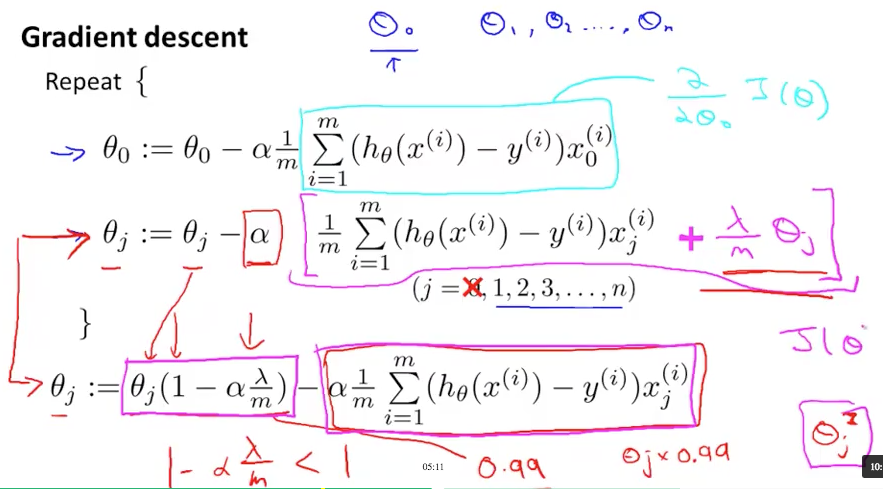

* n : feature number
* m : training data number
* 行列がsingularじゃないならinvertible(逆行列が計算できる)

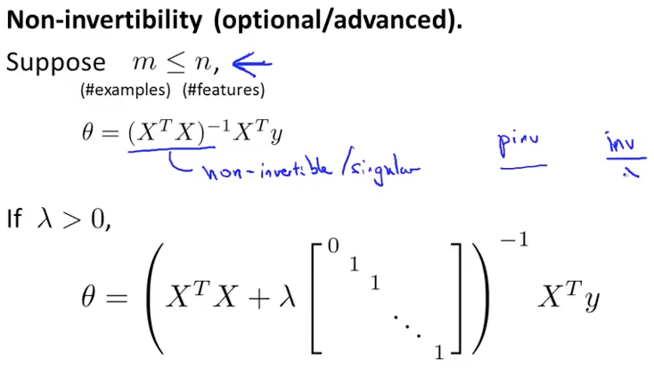

### Regularized Logistic Regression

* すでに最適可能方法としてGDと、Octaveの関数を用いたMore Advancedな方法を伝えている
* それをLogistic Regressionに適用する
* fminunc ... f min unconstrained
* Jに正規化項をつける
* fminunc ... Advanced Optimization

### Regularization Quiz

* 4/5 pass

### Programming Assignment

* 生徒が入学できるかを推定する
* plotの肩慣らし
* 1.2 sigmoid
* 行列を入力として受け取るためには、elementwise演算子のドットを使う
* 1 ./ ...
* コスト関数の実装

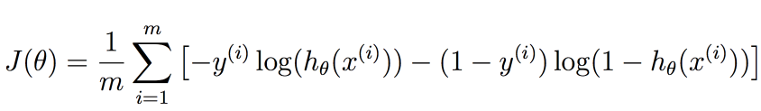

* 右肩はi番目のデータという意味
* 仮データX = [1 10 20; 1 11 22]
* Atomにlanguage-matlabを入れた
* submitするときにセミコロンが入ってない式があるとPrintしてしまう
* fminuncを使うとlearning rateを決める必要がない。自動で決めてくれる
* 非線形のデータ分離
* これはLRをストレートに実行してもダメ。そのLRは線形分離だから
* そこで、2.2 Feature Mapping

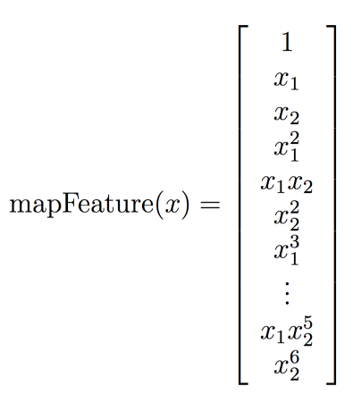

* featureを増やしたと言うことはOverfitしやすくなる
* そこで正規化
* J, gradは正規化分を書き足せばsubmit Passした
* fminuncを使うとはいえ、正規化項の重みλは決める必要がある。1とされている
* 小さくするとoverfit
* 大きくするとunderfit
* 課題は全部通った。100/100

[week4 note](https://github.com/peroon/coursela/tree/master/machine_learning/week4)