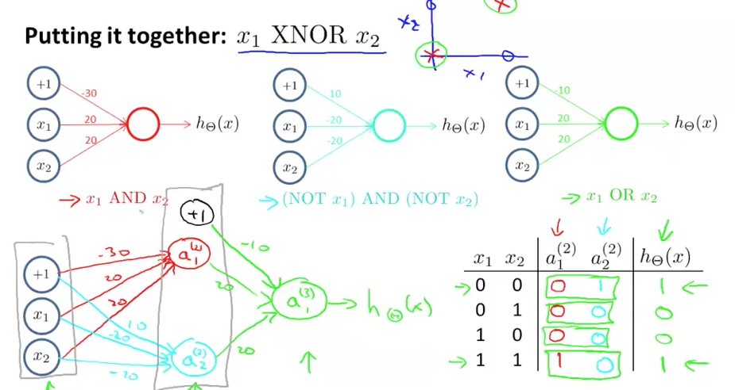

# Week 4 Neural Networks: Representation

* スマホの音声認識
* 小切手を現金にするときの数字読み取り (cash a check)
* なぜNNが必要か。今までの手法ではだめか
* 特徴が２つの場合はLogistic Regression + 特徴の多項化で非線形分離できたが、特徴が100などのときは組み合わせが多すぎる
* n = 100のとき、組み合わせは5000ほどになってしまう. O(n^2)
* すると計算量的にきついし、Overfitする

* x1^2, ...などの2乗だけの特徴を使って数を減らすと、図のように楕円形じゃないとフィットしない
* x1 * x3 * x17 のように3項の特徴まで使い出すとO(n^3)
* そして実用において、nは大きい
* たとえばComputer Vision
* コンピュータにとって、車のハンドルは数値の列にしか見えない

* 50x50 pixelでも特徴ベクトルの次元n = 2500
* RGBなら7500
* NNは80s, 90sに流行ったがlate 90sには衰えた
* 現代、また注目されている resurgence
* アプリケーションごとにAlgorithmを作る必要はない仮説
* 例 auditory cortex (耳)
* auditory cortexと耳のつながりを切って目とつなげてみたら、acは見ることを覚えた
* (re-wiring) つなぎかえ
* BrainPortプロジェクト
	* 舌で見る
	* 音を鳴らしてソナーで周りを理解する

### NN

* neuronは電気のPulseで情報を伝える
* NNではシグモイド関数をactivate functionという
* NNではθをweightという
* x0 : bias unit, 値は1
* input/hidden/output layer
* 訓練時、input/outputは見れる(x, y)けど、中間は見れないのでhiddenといわれている

### 記法

### Model Representation II

* vectorizationできる
* forward propagation 前に前に伝わっていく
* input/output layerもaとして考えて一般的な式にできる

* NNはn層とn+1層の関係だけを見るとLogistic Regression
* XORゲートを学習できるか(1 0, または0 1のときのみ1を出力)
* まずはANDゲートから考えよう
* たとえば下のようなweightが学習できればいい

* 真理値表 truth table
* AND, ORのweight例は示された
* NOTもつくれる
* それらの組み合わせでXNORなど他のも作れる

* 回転・スケール・ノイズに対応して数値認識できているビデオ

* 384などの3桁もいけてるのがすごい

### 多クラス分類

* 問題にて、(5+1) * 10 = 60

### Quiz

* 問5が難しい！？
* 1, 5を間違えた・・・ 3/5
* 5について図を書いてみると、変わらないと気づいた
* リトライ。チェック問題は内容が変わってる？5/5でPass

### Programming Assignment: Multi-class Classification and Neural Networks

* load('ex3data1.mat')するとX, yにデータが入る。バイナリ形式
* 7.5MBもあった・・・
* 正解データyはラベルのベクトル1...10(0を表す)なので、0,0,0,...,1形式のベクトルにする必要がある
* このデータはMNISTからきている
* yってラベルのままでいいの？
* J, gradをVectorizeな計算して定義するだけで、多クラスはまだ意識しなくていいのか
* 先週の課題をfor使わずに実装すればいい
* 部分配列のend sum(z(2:end).^2)
* Octave落ちる・・・

#### 課題１から苦戦する

* lrCostFunction.mでWeek3のコードをもってきたけど通らない。なぜ？
* part1.mを作って仮データで動作確認すると、J, gradともに0になっている・・・
* lrCostFunction通ってなくない？printされない
* なんと、Downloads以下のコードを編集していた
* 先週のコードを貼り付けると課題1は通った
* vectorizeは保留

### 課題２
* ラベルをLogical Arrayに変換する（どれかが１で他は０のベクトル）
* 実装してSubmitしてPass、通った！OK
* でも実戦では正しく動いた場合のθや判別値をテストとして用意しておいて、それとの一致を確かめる必要があるだろう
* fmin系の最適化はかなり便利
* パラメータが多い場合(まさにNN)はfminuncではなくfmincgを使うらしい

### 課題３

* No problem

### 課題４
* Xθがいいのか、θXがいいのか
* どっちでも計算できてしまうから迷う
* Layerが増えたときに整理しよう！
* No problem

[week5 note](https://github.com/peroon/coursela/tree/master/machine_learning/week5)