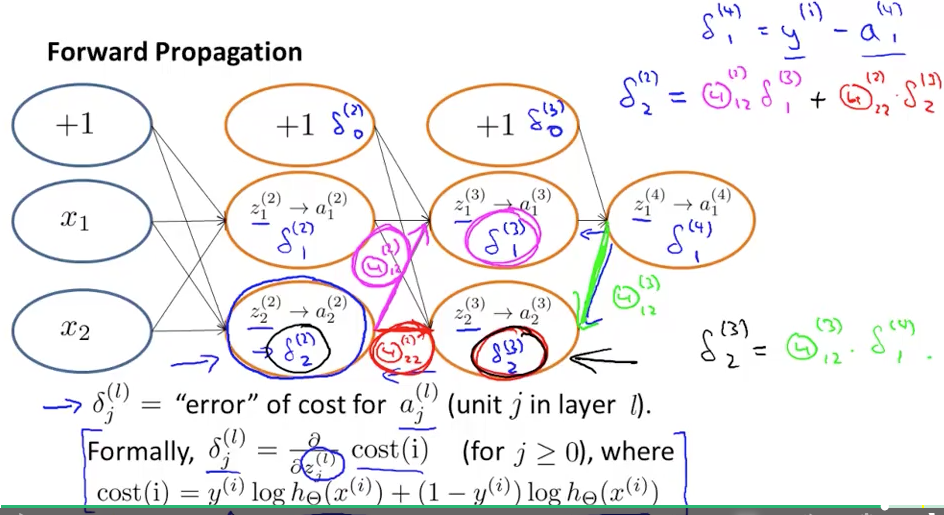

# Week 5 Back Propagation

* このコースの山

### Cost Function and Backpropagation

* L : レイヤー数
* s_l : レイヤーlでのユニット数
* コスト関数はLRの一般化

* fminuncに食わせるためには、J, gradが必要。gradはJのi, jで微分
* 量が多すぎる？
* a = activation values
* バックプロパゲーションにおいて、g'がでてきた理由は？
* δ（デルタ）を後ろから計算していく
* そこからJのi, j微分が求まるらしい。直接は微分できないの？
* 証明が必要？

* jってなんだっけ？各レイヤーのノードのindexか j=0はbiasノード用
* i = 1:m

* 証明できなくてもコードは書けそうだ

### Backpropagation Intuition

* データごとに、forward propagationしてbackpropagationしてΔに加算する
* シンプル化して直感をつかもう

* δはweighted sumされて後ろから前に求められていく

### よくわからなかった直感的な図

* エラーを前に求めていく方法はわかった

### Implementation Note: Unrolling Parameters

* unrolling (matrix to vector)
* fminuncに食わせるにはθがベクトルである必要があるのかな？Yes
* 一方NNの各レイヤーのθは行列
* A(:)で行列がベクトルになる
* 逆に、reshapeでベクトル→行列
* D : derivatives
* 長い縦ベクトルにしてfminincに食わせる

### Gradient Checking

* なんでforward/back propagationしてるかというと、Jの微分を求めるため
* 微分を差分で近似して、微分の実装が正しいかチェックする？
* one/two side difference
* partial derivativeもできる
* backpropで求める理由は、効率がいいから？Yes, 差分で求めるより速い

### Random Initialization

* θの初期値を0にするのはLogistic RegressionならOK
* NNでは隠れ層の出力が全部同じになってしまい、冗長
* 全部同じになってしまうのを破壊する必要がある。symmetry breaking. 対称性の乱れ
* Quizで、各θをそれぞれrand(1,1)で初期化したら、symmetry breakに失敗するらしい。Why?

### Putting It Together

* 以上を組み合わせて実装するが、隠れ層を何層にするかは決める必要がある
* 入力層：特徴ベクトルの次元
* 出力層：クラス数
* 隠れ層の数は多い方がいい。ユニット数は同じにする（これはDeepLearningとの違い？）
* 隠れ層やユニット数が多くてOverfittingすることはない？
* 隠れ層のユニット数は入力層の次元より多い方がいい

* non-convexなのでLocal Minimumに陥ることがある。けれどあまり問題にはならないとのこと？
* どれに落ちても深さは同じくらいになっているのだろう

### Autonomous Driving

* 事例
* カメラ映像を30x32に縮小して処理
* この画像のときは人はハンドルをどう切るかを学習する

### Quiz 

* Q1が難しい。aもδも縦ベクトルなら1しか選択肢なさそうだけど添え字が違う. 3にしてみる
* Q2-Q5は解けた
* と思ったらQ5のみ間違い

### Programming Assignment

* 手書きの数字認識
* 10クラス
* 添え字の関係で、0は10とラベルづけている
* 

