# Week 6

### Evaluating a Learning Algorithm

* アルゴリズムをいくつか学んできたが、活かせる人と行き詰まる人がいる
* うまくいかないときどうするか？
* データを増やすのは、時間がかかるし効果的でもない
* overfittingを避けるため、特徴数を減らす、などなど、選択肢はいくつもあるが、ランダムに行うのは筋が悪い
* Diagnosticsに時間をかけて分析するのがよい

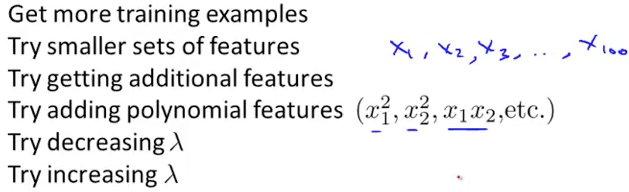

* training errorを減らしてもだめ(overfit)
* 汎化 generalize しないと
* データをtraining/test setに分ける 70% : 30%くらいに
* overfitすると、training errorが低く、test errorが高くなる
* Linera Regressionでのテストエラーの定義

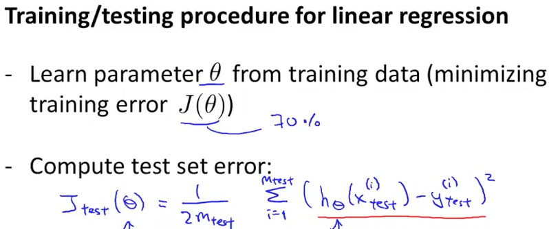

* Logistic Regressionでのテストエラーの定義
* 0.5の閾値で判別するのでエラーも0/1にする考えもある

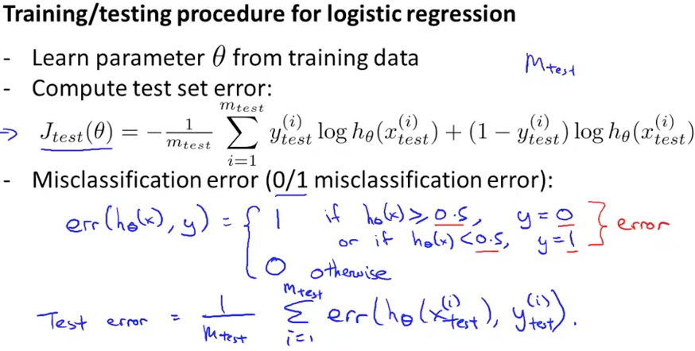

* model selection?
* validation
* x^2, x^3などで特徴を増やすとして、どこまで増やすか(Model selection)
* それぞれでTest Errorを見る
* それでdegree = 5が1番良かったとして、それでmodel selectionは完了だろうか？degree = 5のときの識別率がまだ見ぬsampleへの認識率と言えるだろうか？No. テストデータに最適化されているだけ
* 1番テストエラーが良いものを選んでも、認識率のfair estimateとはならない
* データを3つに分ける。cross validation (CV) setが増えた
* training/validation/test = 60%, 20%, 20%の割合で分けるのがtypical
* model selectionのためにvalidation errorを使う。そこでdegree = 4と決まったとする
* それを用いてtest dataを識別し、estimate generalization errorとする
* validation setを用意しないでtraining/testだけでモデル選択(dを決める)する間違いがよく見られるので注意

### Bias vs. Variance

* bias, varianceを見ることで適切な改善ができる
* underfit : high bias
* overfit : high variance
* 汎化がうまくいってなければoverfitだし、training errorの時点でエラーが大きいならモデルの表現力が低い(underfit)と考えればよさそう

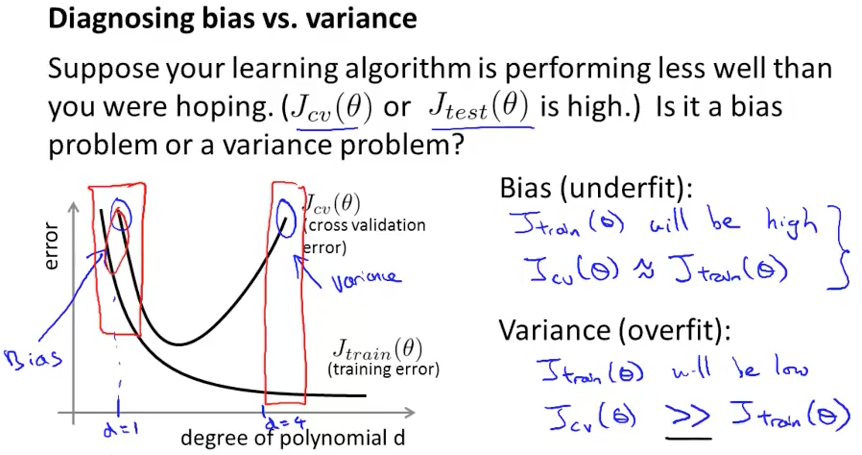

* 正規化パラメータλを調整することでhigh biasからhigh varianceまで変わる
* どうやって適切な値を決めるか？→cross validation errorが低いものを選ぶ
* パラメータは2倍刻みがよさそう 0, 0.01, 0.02, 0.04, ..., 10.24

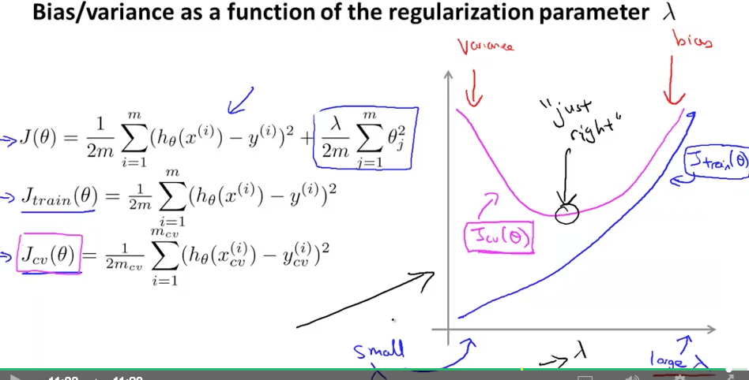

* learning curveはsanity checkに役立つ
* J_cv > J_train
* high bias, 表現力の低いモデルのときにデータを増やしてもfitすることができないので無駄
* high varianceのときはデータ数を増やすのは有効

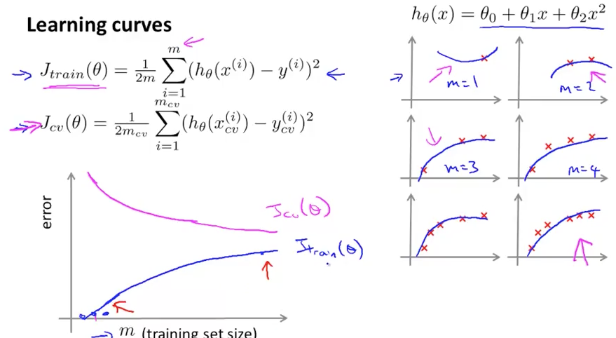
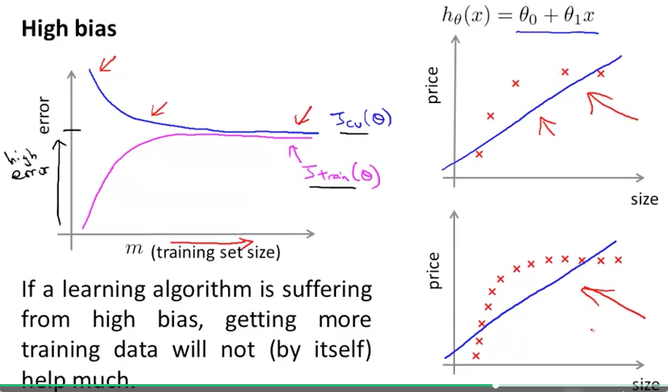
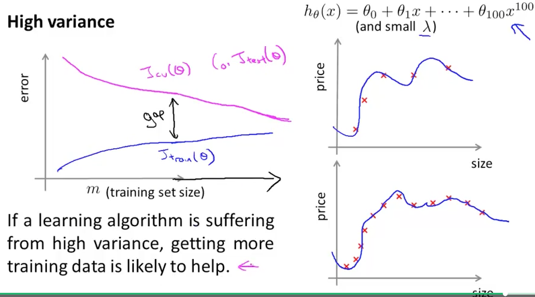
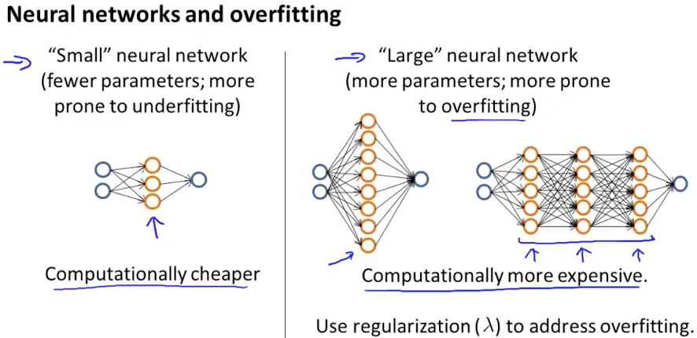

* Deep Learningも隠れ層のレイヤー数やユニット数が多いのでoverfitするはずだが、それを抑える何かがあるのだろう

### Quiz

* Q2, Q5をミスでPassできず。全部チェックする問題は難しい 
* リトライしてPass. high varianceのときはデータを増やすことが有効であることを前回は忘れていた

### Programming Assignment

* TODOにしておいて、下の講義を先に終わらせる

### Building a Spam Classifier

* これから教える手法はtime saverとなるそう。ng教授は無駄な時間を避けることを何度か言っている
* Spamメールは単語をわざと書き換える e.g. med1cine フィルターをかいくぐるためだろう(deliberate misspellings)
* メールを特徴ベクトルにするには、各単語が存在するかの0, 1ベクトルにする
* Spammerはexclamation mark !をよく使う
* 改善したいとして、取り得る手段はいくつもあるが、それを気分で取り組んでいいのか？No

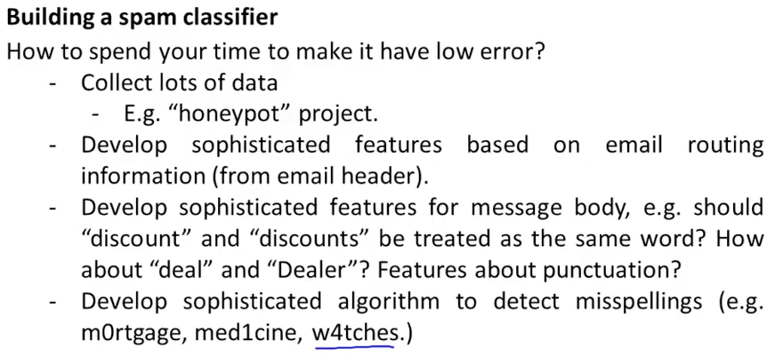

### Error Analysis

* まず難しい手法は使わず1日ぐらいでシンプルに作ってみる
* learning curveを見て、データを増やす、特徴を増やすなど決める
* error analysis. 分類を間違えた例を観察して新たな特徴を考える
* たとえばSpam mailならパスワードを盗む用のURLに注目するなど
* なぜシンプルな実装から始めるかの理由は、分類を失敗する例を観察するため
* discount, discountsなどの変化系は同じとして扱うべきだろうか？
* 同じとして扱いたいなら、stemming softwareがある
* error analysisはvalidation dataに対して行う。test dataではない
* upper/lower caseは区別すべきか？それもvalidation dataのerror analysisで結果を見てみればいい
* 「パラメータをどう決めたの？テストデータに対して最適化されてない？」というのは基本的だけどしておくべき質問
* まずシンプルに完成させて、足りないものを観察して補うという考え方は、他の開発でも使えそう

### Error Metrics for Skewed Classes

* skewed class? 正解に偏りのあるデータのこと
* 0.5%がガン患者のときは、全員健康と判定するだけで99.5%の正解率になる
* そういう分布の時は、正解率だけを評価の指標にしてはいけない
* precision/recallを使う
* 全員健康と判定するズルは、recall=0となりバレる
* precision/recallどちらも高いのが良い
* 何か判別器ができて学習した後、それがズルじゃないかの確認にも使える

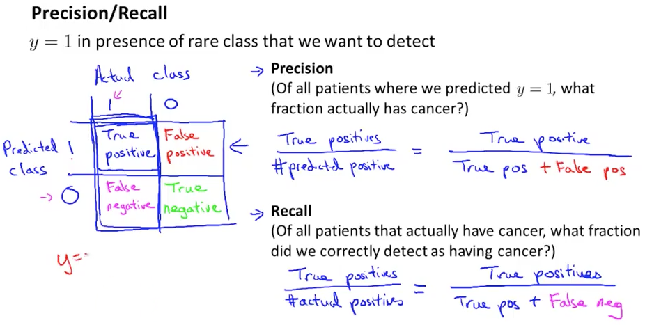

### Trading Off Precision and Recall

* 確度が高いときだけガン判定をつげるには、Logistic Regressionの場合、0.5にしていた閾値を0.7にすればいい
* ガンを見逃すの大問題だとするならば、多くの人をガンと判定してしまえばいい。閾値を0.3にすればいい
* どちらもprecision/recallのトレードオフとなる。どちらを望むか
* F1 scoreを使うと、低い値の影響を大きく扱える
* クロスバリデーションセットにおいて、閾値をいろいろ変えて、1番F1値が高い閾値を選べばよい

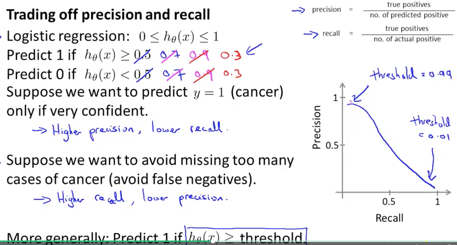
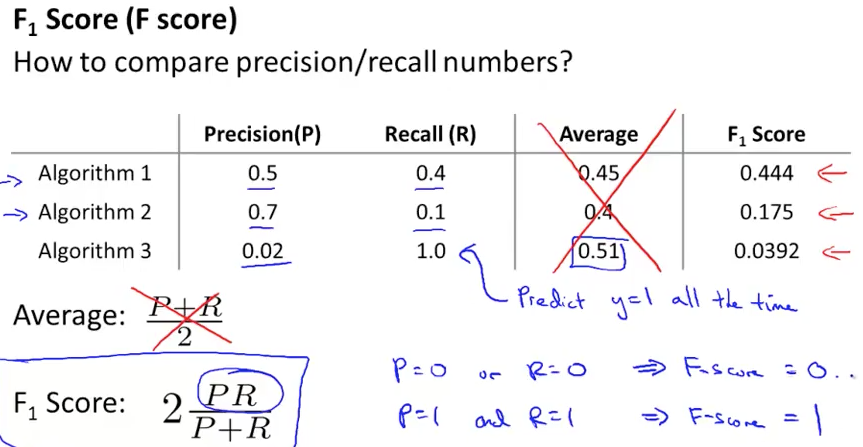

### Data For Machine Learning

* いくつかの識別器の方法があったとして、それを全部試すのはテストデータに最適化されるだけ
* 図ではデータ数によって逆転している
* その分類は人間ができるかを確認するのは有効
* 特徴が多いなら複雑な判別ができるが、多くのデータが必要
* 特徴が多いならunderfitする可能性はないのでlow biasで、大量の訓練データがあればlow varianceも実現できて良い識別器となる

### Review Quiz

* Passed

### Programming Assignment

* 後回しにしていた分
* regularized linear regressionをbias/varianceの視点から見る
* 正規化されたLogistic Regressionは前書いたのでそれを真似る
* gradはほぼ同じコードでいけた
* 