# Week 7 Support Vector Machine

### Optimization Objective

* SVMはclear and powerful
* LRのsigmoidを折れた直線(non linear)にしたらSVMになる！？その視点からの理解はしたことがなかった
* LRは誤差部分Aと正規化部分Bの関係が A + λB
* SVMではCA + B と書く。C = 1/λかな
* SVMの出力は確率ではなく0/1

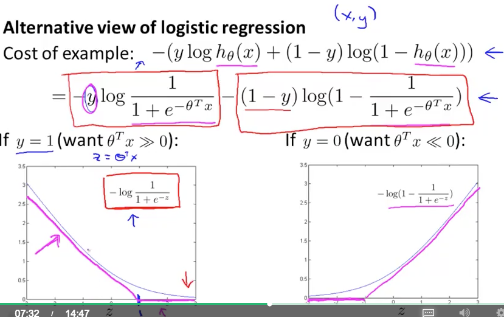

* LRではθXが0という閾値で結果が決まっていたが、SVMの閾値は-1/1
* safety margin factor?
* Cがすごく大きいとき
* SVMはlarge margin classifierとも呼ばれる
* 高次元空間で切る話はまだ出てこない
* Cが大きすぎるとtraining dataにoverfitする切り方をする
* Cが適切だと外れ値(outlier)にdecision boundaryがひきずられなくなって良い


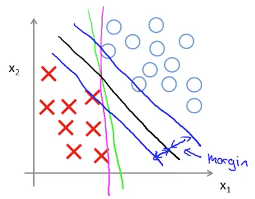

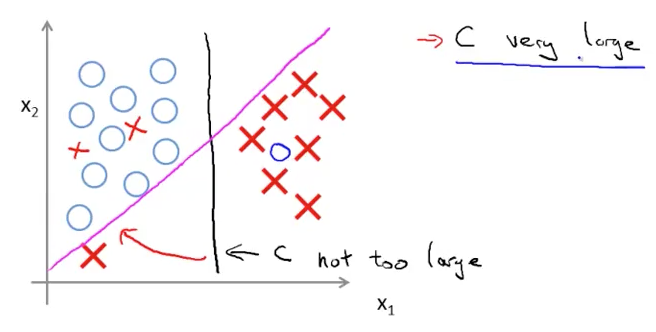

### Mathematics Behind Large Margin Classification

* 数学的裏付け
* Skip可能
* 内積とは
	* 値 ∈ R
	* 射影
	* 負にもなる(2つのベクトルの角度が90度以上)
	
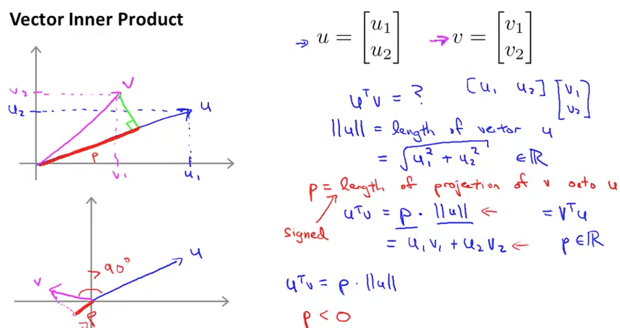

* 分離面の垂直方向 = θベクトルの向き
* 分離面が緑色の場合、pが小さくなるのでθの長さが大きくなってしまう
* 一方 min 1/2 signma (θ^2) なので、θが小さいものを選ぼうとする
* 結果、マージン最大の切り方となる
* 外れ値は自然と無視されるのかな？
* 最後の問題、1/2になる理由がわからない

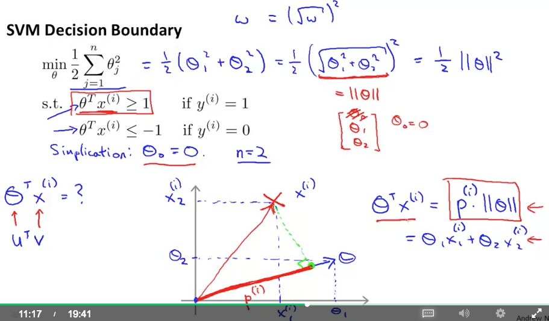
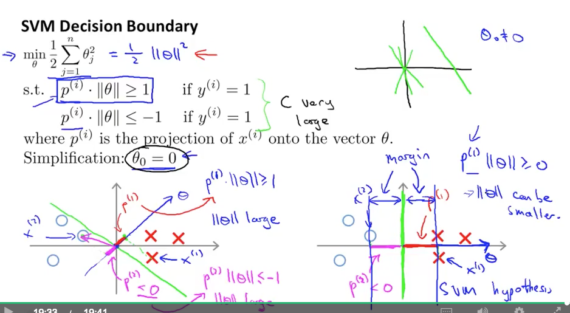


### Kernels I

* ノンリニアな分離。kernelを使う
* 今までの方法の中から考えると、complex polynomial featuresを使う
* kernelは2つのベクトルの類似度を定義する (similarity function) 距離の逆？
* expの場合、同じベクトルを入れると出力は1
* 全く違うベクトルを入れると出力は0
* gaussian kernel内のσは調整するパラメータ
* 分類したいXが与えられたとき、訓練データの中にすごく似ているものがあれば、そこのfだけが残って判定する
* σを小さくするとすごく近いl(landmark)だけを見るのでoverfitしそう
* 逆に、σを大きくすると正解データと正解データの間でも似ていると判定して、ゆるく(undefitぎみに)判定しそう
* まだ教えていないことは、
	* landmarkをどう見つけるか
	* 他のkernelは？
	
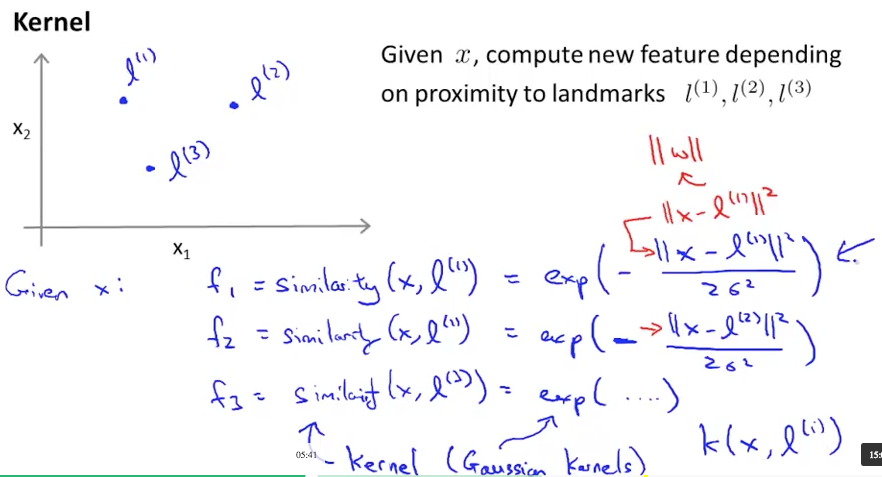
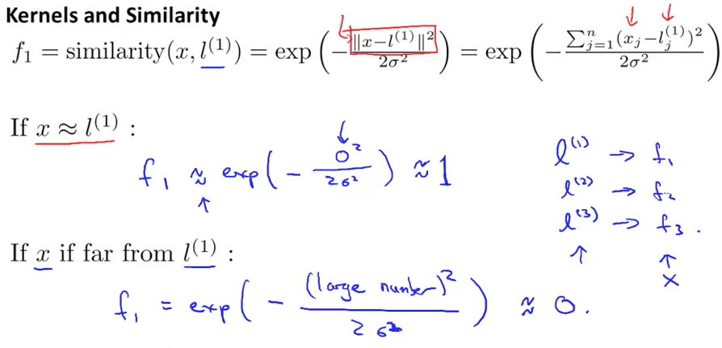
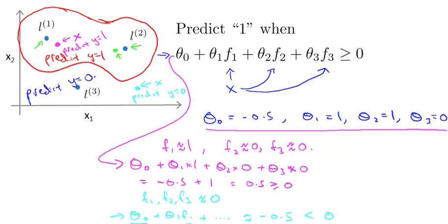

	
### Kernels II

* landmark lをどう見つけるか
* 訓練データXをそのままlにしてはどうか
* その場合、
	* vector xがkernelを通してvector fになる
	* fの次元は訓練データ数m
	* θの次元n
	* n == m ?
	* θの次元はもともとxの次元と同じだったけど、fの次元になっている？
	* θ^2の和はθ^T * θで表されるけど、間に行列Mを挟む. 訓練データ数が多いときにθベクトルも長くなり、最適化のコストが高くなるが、それを抑制する

### Using An SVM

* liblinear, libsvm
* linear kernelを使うのは、特徴ベクトルの次元nが大きく、訓練データ数mが小さい、overfitしそうなとき
* gaussian kernelを使うのは、非線形分離（より複雑な分離）が必要なとき
* 上の2つのkernelがmost popular

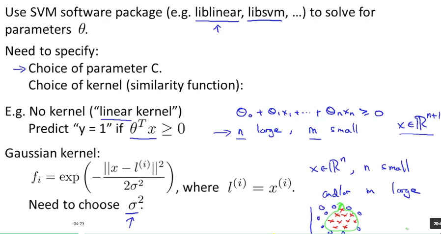
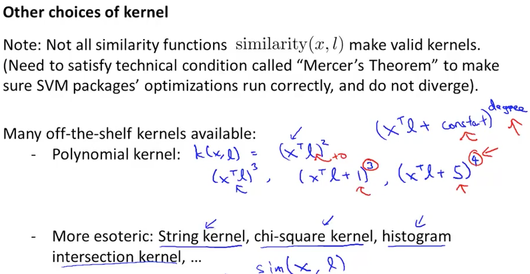

* 訓練データのXはまずfeature scalingしておくこと
* kernelを自作するなら、Mercer's Theoremを満たす必要がある
* 多クラス分類には1-vs-allを使う。packageでは最初から使える
* LRのsigmoidを直線にしたのがSVMという導入だったが、どちらがよいのか？どう使い分けるのか？
* 特徴が多い場合 (n >> m)
	* LRを使う, またはlinear kernel SVM
* n < mのとき
	* SVM with gaussian kernel
* n << mのとき（ビッグデータ時代はこれ？）
	* 特徴不足なので特徴を追加して、LRまたはlinear SVM
* LRとlinear SVMは似ている
* 上記どの条件でも、NNはうまく動く。ただし訓練に時間がかかる
* SVMはconvex optimization problemなのでlocal optimaに嵌まらない
* NNにおいてもlocal optimaは大きな問題にならない

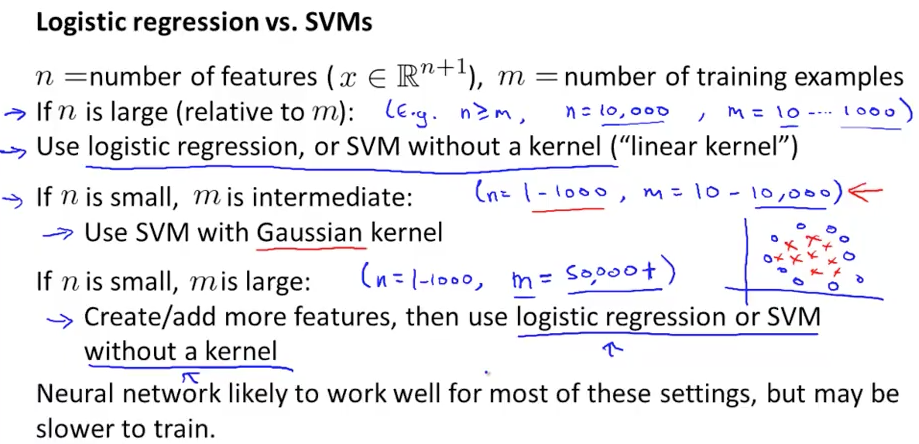


### Programming Assignmetns

* Cを増やすということは、訓練データの誤分類に厳しくするということ
* θ0 : intercept term
* σ : sigma
* λ : ramda
* gaussian kernel = RBF kernel
* C, sigmaの探索。Cが大きいとTrainingが遅い？
* Part2, 訓練でもvalidationで識別率が56.5%しかいかない・・・おかしい・・・
* 識別境界を描画すると、訓練まではちゃんとできている
* errorとpredictionを求める式が逆だった・・・解決。
* Part3. Spam Filter 
* 特徴の前処理として、URLをurladdrと置換したりする
* 意外と地味で手がかかる前処理。Deep Learningならこれもスキップできる？
* すべての単語は使わない。overfitするから
* Part3, 4はeasyだった
* 訓練後、どのwordが判別に有効かがわかる。e.g. guarantee, remove, dollar, price
* でもどうやって？
* 特徴ベクトルと同じ次元であろうmodel.w (weight)からわかる

```
[weight, idx] = sort(model.w, 'descend');
vocabList = getVocabList();

fprintf('\nTop predictors of spam: \n');
for i = 1:15
    fprintf(' %-15s (%f) \n', vocabList{idx(i)}, weight(i));
end
```

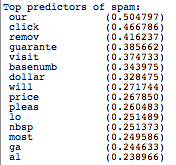