# Week 8 : Unsupervised Learning

* クラスタリング
	* market segmentation
	* text summarization
	* social network analysis
* Principal Component Analysis 主成分分析
	* speed up learning algorithms
	* data visualizing
	
### Unsupervised Learning: Introduction

* Unsupervised learningにはラベルがない
* find some structure

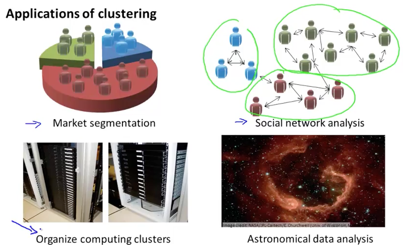

### K-Means Algorithm

* clustering -> coherent subsets
* 1. cluster centroidsを決める
* 2. loop
	* cluster assignment 1番近いcentroidに属する
	* move centroid to mean
* Quizがわからない・・・c_1, c_2が共に3に収束した？？
	* c_iの定義 : i番目のデータが属するクラスタのindex
	* μ_k : 各クラスタの平均
	* これをふまえると、解けた
* どこにも属さないμができたら？
	* 除去する or
	* K個のクラスタが必要なら、ランダム位置に移動する
* 次のレッスンでは、nuts and bolts（基本）を学ぶ

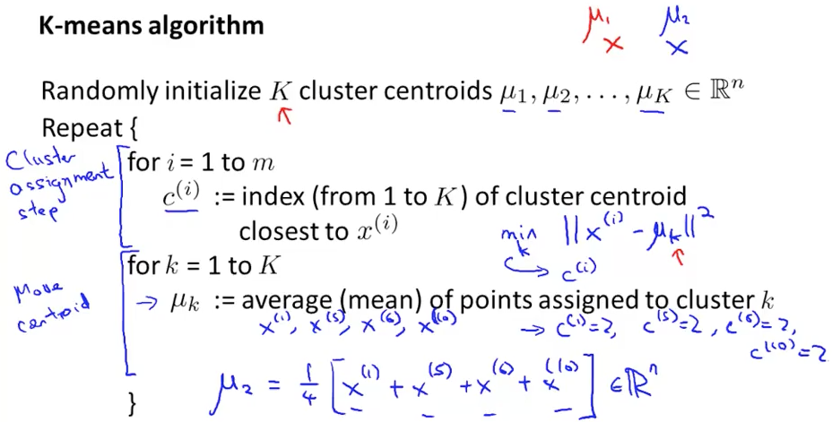


### Optimization Objective

* unsupervised learningでもコスト関数最適化の考えを使うことで、実装が正しいか確認できる
* wrt : with respect to
* 最適化のループを回している中でコスト関数が上がることがあればそれはバグである

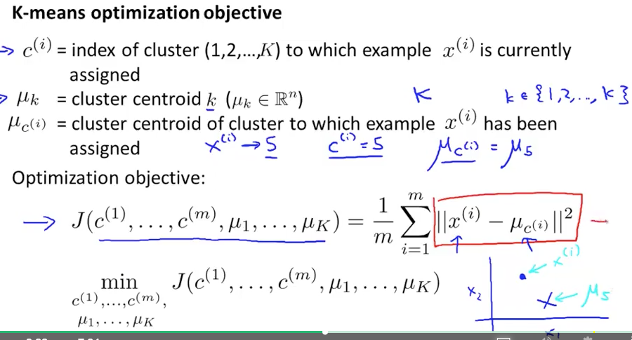

### Random Initialization

* 最初のμはランダムに選ぶが、訓練データからランダムに選ぶのが良い
* local optimaにはまることはある
* k-meansを何回もすればいい
* Kが10を越えると、何度もやってもそんなに差は出ない

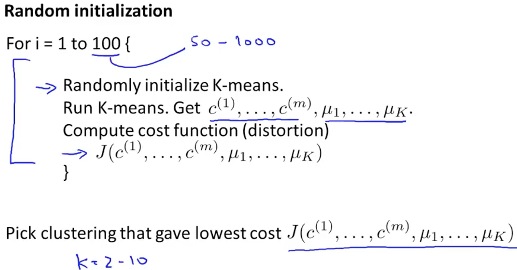

### Choosing the Number of Clusters

* Kをどう決めるか
* あるデータを見たとき、2つのクラスタに見える人もいるし、4つに見える人もいる。つまり、決められない
* クラスター数を増やせばJは減るが、Kを増やせばいいわけでもない
* Kを増やせばJが必ず減るわけではない。local optimaにはまればKが大きくてもJも大きくなる
* Elbow methodでKを決めるのもいい。ただしElbowが曖昧なこともある（カーブを近似して微分したらどう？）
* クラスタリングした後の用途を考えて、人間がKを決めるのが良い

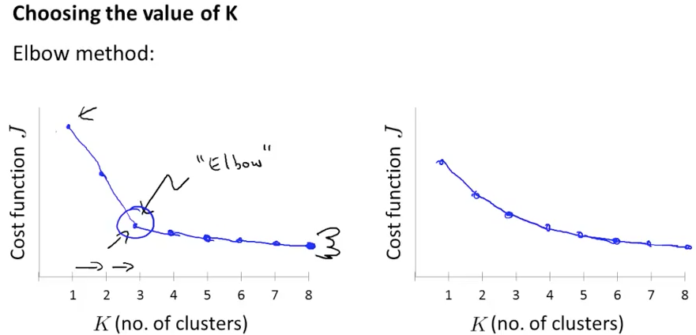
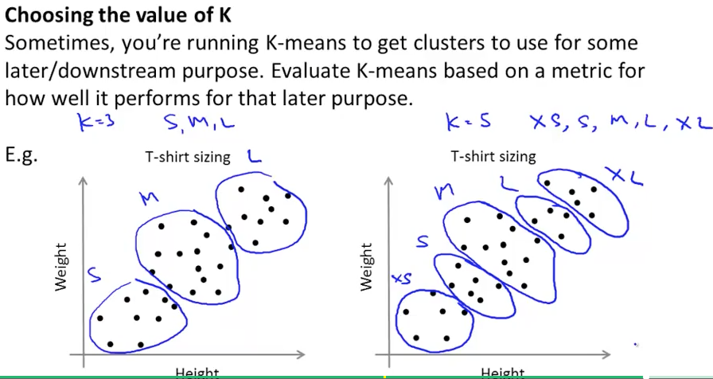

### Quiz

* Passed (No Problem)

### Dimensionality Reduction (by PCA)

* このdimensionality reductionでdata compressionできると、
	* memory, disk reduction
	* speed up learning algorithm
* いろんなところから特徴を集めると重複する redundant features
* 2Dのデータ→1Dのデータにリダクション。3D->2Dも同様。データがcorrelateしてたらできる
* Octaveで3D plotはグリグリ視点を変えられる

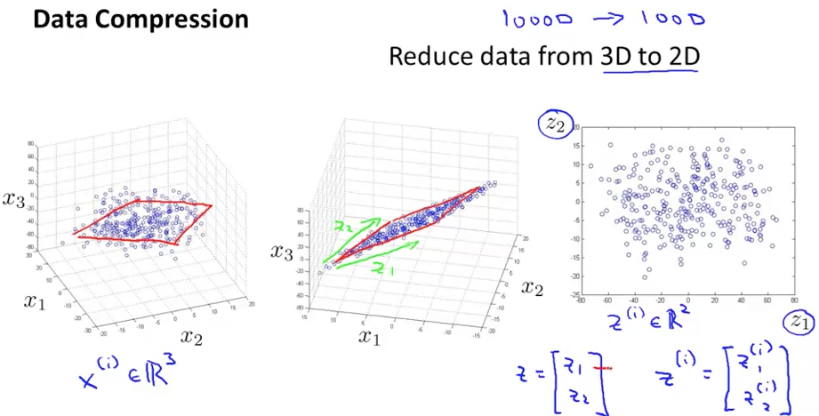

### Motivation II: Visualization

* データを理解するのにVisualizingは良い
* 50次元を2次元にreductionしてplotする。そのときの特徴z1, z2には意味はない
* 下の絵だと軸に意味が書いてあるのは、有効な特徴を上位から２つ取ってきたのだろう

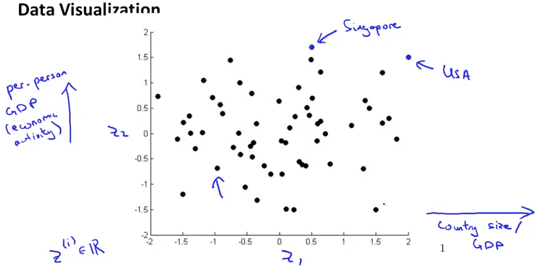

### Principal Component Analysis Problem Formulation

* formulate : 定式化する
* 次元を落とした面への射影距離(projection error)の二乗和をminにする
* 事前処理としてmean normalizatoinしておく(zero meanになる)
* PCAは面に垂直に落とした距離の二乗和なので、LRとは違う

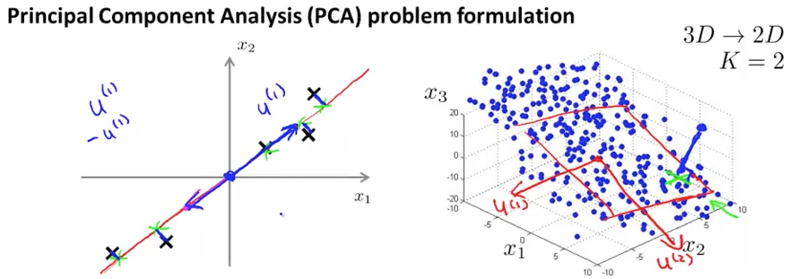

### Principal Component Analysis Algorithm

* 前処理として
	* meanで引いて
	* sで割る (s : standard deviation)

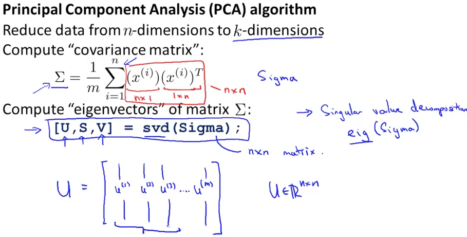
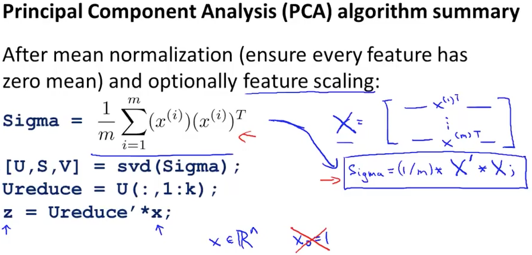

### Reconstruction from Compressed Representation

* 応用として、データをcompressしたものからの復元
* x -> zとは逆方向なので、z = U * xに逆行列をかければ逆変換できる

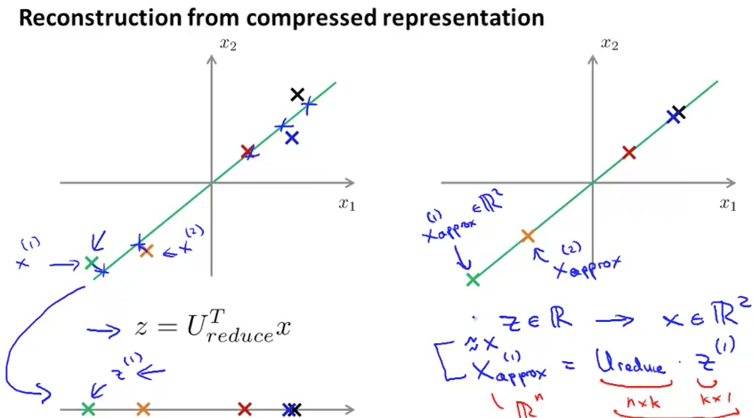

### Choosing the Number of Principal Components

* kをどう決める？
* 0.01 : （発音）オー・ポイント・オー・ワン
* 99%のvarianceが保持されるように決める（高い印象）
* （PCAで画像圧縮できそう）
* 現実のデータはhighly correlatedなので99%のvarianceを残しても多くを圧縮できる
* denominator : 分母

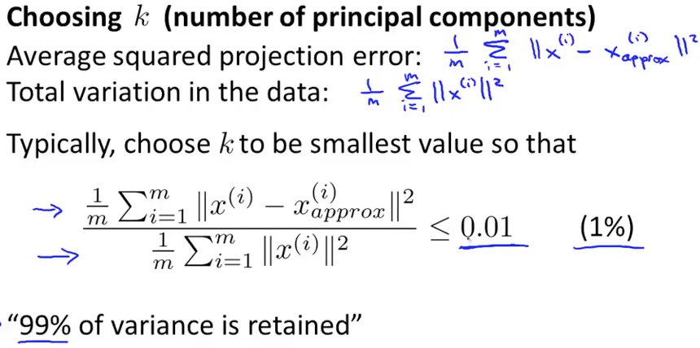
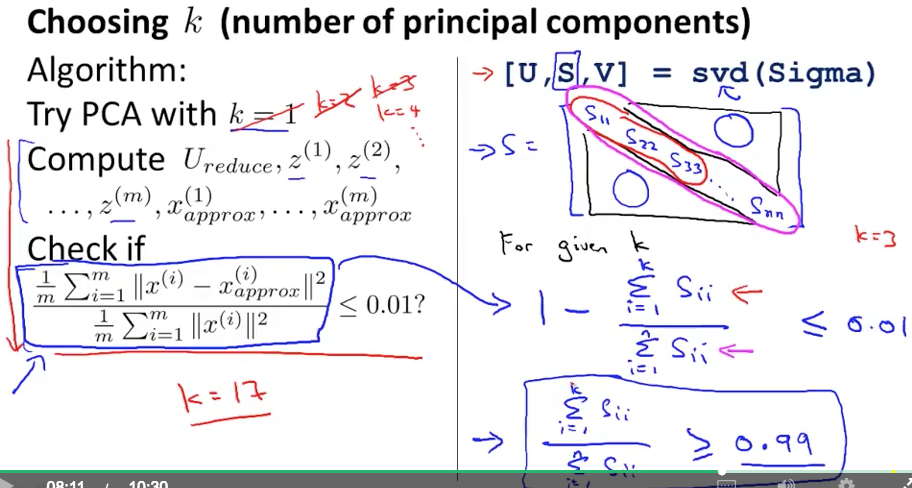

### Advice for Applying PCA

* supervised learningのXの特徴の次元がとても大きいとき、次元削減すると学習速度が上がる
* 特徴を沢山集めたけど冗長に重なっている印象があればPCAでreductionするとよさそう
* 訓練データでmean normalizationやPCAのUを求めたら、そのパラメータをそのままvalidation/test dataにも適用する
* 次元削減することで学習は速くなるだろうけど識別率は下がりそう。トレードオフ
* 次元削減するとoverfitしにくくなるが、その用途ならλを使うべき
* 次元削減は情報を捨てているので、99%は残したとはいえ、貴重な（識別に重要な）1%を捨てている可能性がある
* 最初からPCAを取り入れるのではなく、まずはXのまま学習させてみるのがよい
* メモリやDiskが足りなければPCAを検討すればいい
* 最初から知ってることを全部入れて複雑にしすぎるのはよくないということだろう

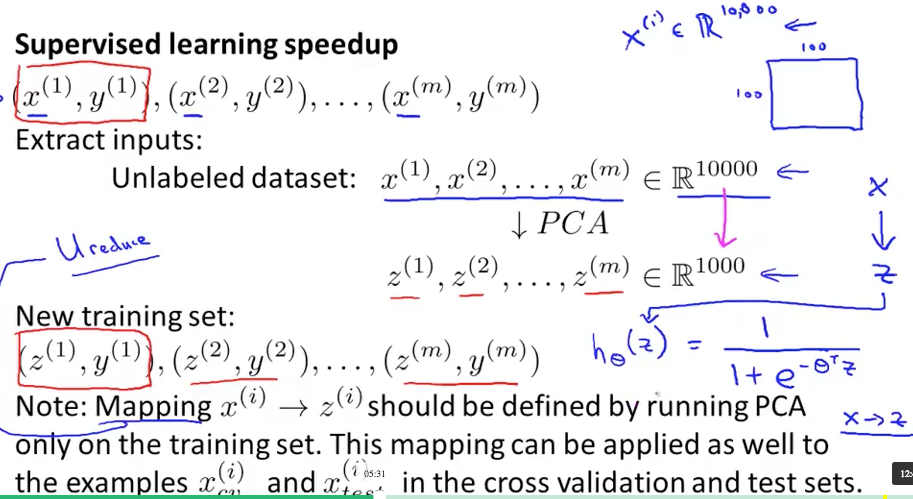
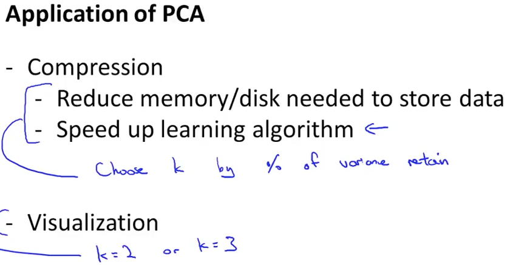
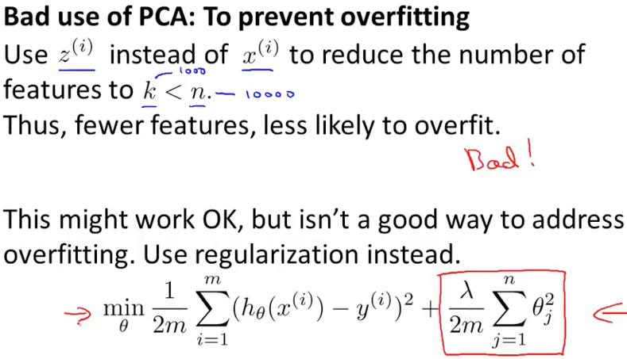
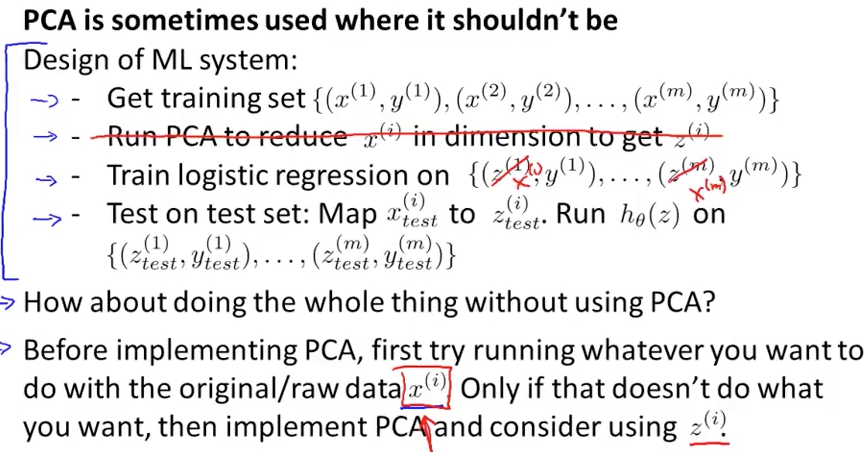

### Quiz

* Passed. No Problem

### Programming Assignment

#### k-means

* k-meansで画像圧縮。きた！
* PCAで顔画像の低次元表現。eigenface?
* meansが行と縦のどちらに行うか、指定すべき
* 指定しなければデフォルトは縦に平均を取るが、入力が行列じゃなくてベクトルの時は気を利かせて横にmeanしてしまうため
* centroidの初期値をサンプルからランダムにK個決める方法↓

```
% Randomly reorder the indices of examples
randidx = randperm(size(X, 1));
% Take the first K examples as centroids
centroids = X(randidx(1:K), :);
```

* 例: randperm(3) = [2 1 3]
* permute: 並べ替える
* 画像圧縮。RGB各8bitの画像を、16色で表現する　→1画素に4bitで済むようになる
* 画像はimreadで読む
* A = imread(path);
* A(row, column, rgb);
* A(1, 2, 3); %1行2列目のBlueの値
* centroidが決まったら、各ピクセルを一番近いcentroidに割り当てる
* 24bit -> 4bitなので、画像サイズは1/6になる

#### PCA

* やり方
	* 特徴をスケーリング
	* covariance matrixを求める	
	* それのeigenvectorsを求める
	* eigenvectorをk本並べた行列でデータXを射影する
* 代入時の注意 Zのi行目に代入したいとき、Z(i) = ではなくて、Z(i, :) = と書かないと次元が合わない
* 
	