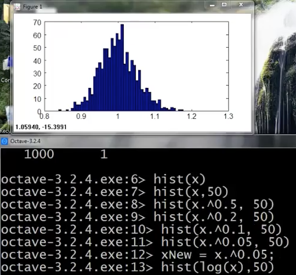
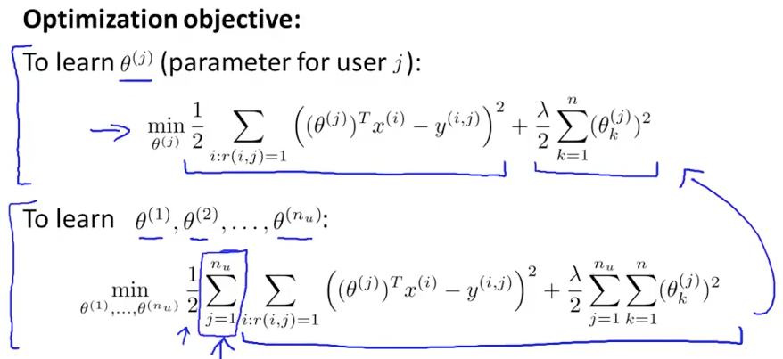

# Anomaly Detection

* fraud detection (credit card)
* avarageからの逸脱で検知する
* defect検知で商品の製造チェックもできる
* ガウス分布を使う
* unsupervised learningである

### Density Estimation

* aircraft engineを作っているとして、quality assurance testの結果を特徴ベクトルとして判定する
* plotすれば異常はわかる
* 正常なデータを確率分布でモデル化して、判定したいデータを入れて見て確率を見る
* クレジットカードのfraud detectionの場合
	* ログイン頻度
	* page view
	* transaction回数
	* typing speed
* Manufacturingの場合
	* 動かしてみたときのCPUやMemory, disk access, network trafficなどの各計測値

### Gaussian Distribution

* パラメータ
	* mu = mean 平均
	* sigma squared = variance 分散
* bell shape
* sigma: standard deviation
* データはガウス分布から発生したと考える
* maximum likelihood estimation

### Algorithm

* 各特徴を別々にガウス分布でモデリングする
* independence assumption 独立を仮定している
* もし関連していたとしても、この独立モデルはうまく動く
* アルゴリズム
	* 1. 特徴を選ぶ
	* 2. 分布のパラメータを訓練データから求める
	* 3. そのモデルで判定する
	* (1. に人の判断が入ってしまう。3. でも判定時のεを決める必要がある)

### Developing and Evaluating an Anomaly Detection System

* 学習はunsupervised learningだが、validation/testでの評価のためにlabelも必要
* ある特徴を足すべきかどうかもvalidation/testで評価できる
* cross validation
* labeledデータのnormal/anomaryの割合には差がある（anomalyの方が数が少ない）のでclassifiction accuracyで良さを測ればいいわけではない (skewed classes)
* F1 scoreなどを使う
* ガン判定の時と同じだ

### Anomaly Detection vs. Supervised Learning

* なぜsupervised learningを使わないのか。正常と異常を学習していれば異常も検知できるのでは
	* それは、異常データは数が少ないから
	* 異常データは、過去の異常データにないものも発生する
	* 正常データがたくさんあるから、それだけをモデル化して異常検知する
	* 一方SpamメールはSpamの訓練データもたくさんあるのでsupervised learningする
* 正負のデータの割合から使うアルゴリズムが変わる

### Choosing What Features to Use

* データの分布をヒストグラム表示して、ガウス分布に従っているか確認する
* 左寄りだったらlog(x)を通すことでガウス分布に近づけられる
* sqrtなどでもいい

* x5: 無限ループに陥ったとき、CPU loadは上がり、network trafficは下がると考えて組み合わせ、新しい特徴 x5 を作る

### Multivariate Gaussian Distribution

* 多次元正規分布
* 各次元で見ていては見逃すanomalyがある
* データがcorrelatedのとき、多次元正規分布は斜めの楕円になる
* positively/negatively correlated

### Anomaly Detection using the Multivariate Gaussian Distribution

* いつでも多次元版を使えばいいというわけではない。訓練データ数 m が多いとcomputationally expensive
* 多次元のかけ算で表したとしても、特徴の組み合わせで新しい特徴を作ればデータ間の関連も組み込める
* 多次元でやるなら、m >= 10 * n くらいデータ数があるのが望ましい
* covariance matrixがsingular (non-invertible)なことがある
	* m > n を満たさないとき or
	* 特徴がredundantなとき (線形代数的にはlinearly dependent
* 逆行列の計算コストは？ [link](http://fast-programming.aglk.net/matrix-calculation/) N^3

---

# Recommender Systems

* Amazon, Netflix, eBay, iTunes Genius, etc
* 異なるユーザの行動パターンを見る
* シリコンバレーの機械学習エンジニアが改良したいものは？recommender system
* academicでは取り上げられにくいが、ビジネスだとよく使う
* recommender systemは、missing value "?" を埋める

### Content Based Recommendations

* とは？
* 1手法としてLRを使えば、各ユーザの評価の仕方をモデル化して、未評価の映画の評価を推定することができる
* least square regression
* more advanced optimization algorithms: conjugate gradient, LBFGS, ..
* しかし各映画の特徴ベクトルを求めることが必要。そこで次回は・・・

### Collaborative Filtering

* feature learningとも言われる
* 特徴ベクトルを作るのは大変。映画の場合は各映画を見なければいけない？（機械が映画を見てくれないかな）
* xを求めるのは大変
	* θがわかるとxがわかる
	* xがわかるとθがわかる
		* θをランダム初期化してxを求める→そのxを使ってθを求める→このループでxを求める
* このアルゴリズムの前提
	* 各ユーザが多くの映画をレビューしている
	* 各映画が多くレビューされている

### Collaborative Filtering Algorithm

* θ, xを同時に求める方法がある
* θ_0は今回出てこない。これでgradなどで特別対応しなくてよい
* （今まではなんでθ_0があって、今回なんで不要？）
* x, θはランダム初期化する（ゼロ初期化したら問題が起こる？）

### Vectorization: Low Rank Matrix Factorization

* low rankとは？TODO
* low rank matrix factorizationとは？TODO

### Implementational Detail: Mean Normalization

* 1つもrateしてないユーザの嗜好θは決められるか？
* 最適化したい式に正規化項があるが、それはθをゼロベクトルに向かわせるよう働く、しかしそれは何もreocommendできなくなってよくない
* しかしθベクトルを0に近づける力は、overfitを避けてくれるので残したい。そこで・・・mean normalization
	* 教師データのYから平均μを引いたものをYとする
	* predict後は予想値にμを足す
* 今回の映画recommendationでは学習データ(of movie ratings)のスケールが合っているので、事前処理としてのfeature scalingは不要
* n: 特徴ベクトルxの長さ

### Programming Assignments

* anomaly detectionでサーバが落ちたかを判定する
	* 便利！
* 

