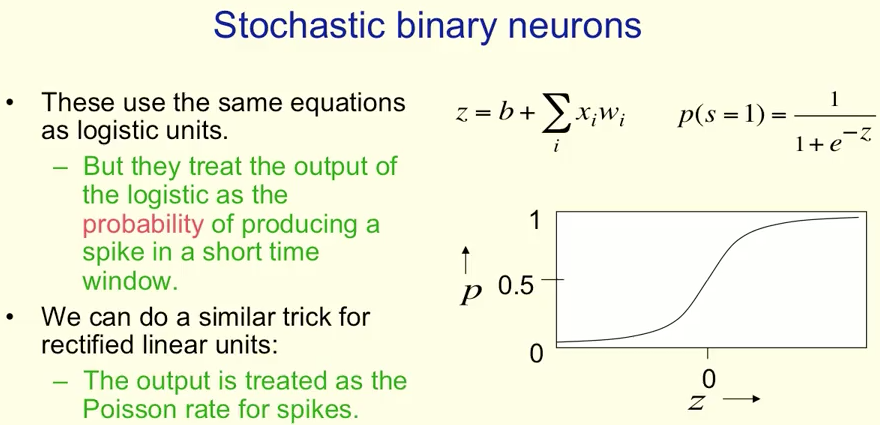
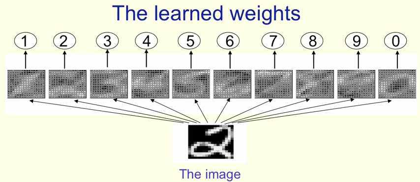

# Week 1

## Why do we need machine learning?

* たとえば3D物体認識が脳でどう処理されているのか分からない
* クレジットカードの不正利用検出も、多くの小さいルールがあって書ききれない
* （機械学習は人間の代わりにプログラミングしてくれる）
* 物体認識の他に、音声認識も得意
	* 10msごとに音を分割してacoustic coefficientsにして音素(phoneme)を推定する
* （スライドは少し黄色くして文字の色分けもされている. スクショとって貼り付けるとき黄色は困る）
* MS Research, IBM, Googleの比較表。Googleが1番多くの訓練数と時間がかかるが1番良い結果
* Deep Learningは音声認識のやり方を変えた
	* （結果使い物になるレベルになり、Google Assistantなどが出てきただろう）

## What are neural networks?

* （NNって、最初は脳を真似たけれど、学習の部分は全く真似ていない。脳を模倣してはいない）
* 生物の脳の話

## Some simple models of neurons

* モデル化するときに、まずはシンプルにする (Idealized)
* principleが分かれば、簡単に複雑さを後から入れることができる
* （シンプルにはじめよ）
* 確率的に発火するモデルもある

## A simple example of learning

* これでは各クラス１つだけのテンプレートマッチングになってしまい、初めて見た値には対応できない

## Three types of learning

* supervised learning
	* regression
	* classification
	* x, y, Wからなるモデルを作り、出力とyの差（エラー）を最小化してWを決める
* reinforcement learning
	* 学習して得られるものは、sequence of actions
	* 未来のsum of rewardを最大化するように学習する
	* 遠い未来のrewardはdiscountする
	* 学習の途中で間違った道を進んでいるかわかりづらいので、強化学習は難しい
* unsupervised learning

## Quiz

* 2/6 fail... very difficult
* third try passed 6/6
	